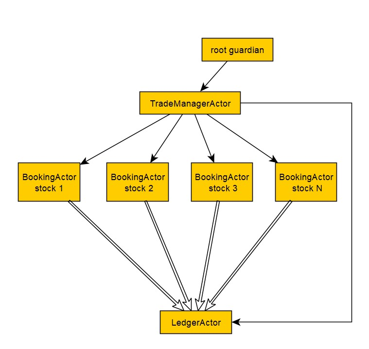
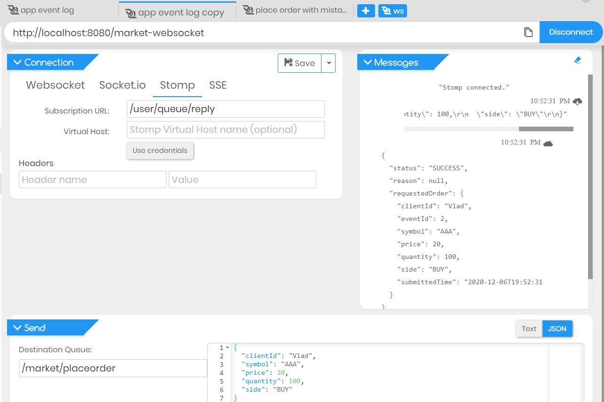
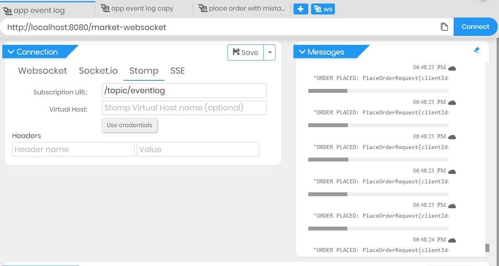

## yet-another-stock-market-simulator [YA-SMS]

The application simulates a stock market.<br/>
Clients can interact with the application via REST and websocket API.<br/>

The implementation is based on Spring Boot and Akka actors.<br/>
Akka is used as a backbone to implement fully reactive way of communication between system components.<br/>
Akka actors allow us to encapsulate the state and execution avoiding the use of error prone low-level concurrency constructs like atomics or locks.<br/>
As state of Akka actors is local and not shared, changes and data is propagated via messages, which maps to how modern memory hierarchy actually works.<br/>
According to Akka documentation "this means transferring over only the cache lines that contain the data in the 
message while keeping local state and data cached at the original core."<br/>

The system can be pictured as the following diagram.<br/>
 
<br/>

The whole model is simple.<br/>
All communication is orchestrated by the main actor - **TradeManagerActor**.<br/>
Main actor is responsibe for:<br/>
* spawning the child actors.
* managing the state of child actors.
* routing the messages to dedicated child actors.
* supervising child actors lifecycle and state.

When the order placement message arrives the **TradeManagerActor** creates the child actor if it does not exist yet - the **BookKeeperActor**.<br/>
**BookKeeperActor** is created and its reference is bound to a particular symbol (book ID).<br/>
After **BookKeeperActor** is created all subsequent messages is routed to it.<br/>

The **BookKeeperActor** contains the state of BUY and SELL books.<br/>
It also encapsulates the logic of books balancing ( crossing ).<br/>
During the balancing **BookKeeperActor** can send a message to the **TradeLedgerActor** if the Trade happens.<br/>
**TradeLedgerActor** is created by **TradeManagerActor** on application startup and manages the state of all transactions.<br/>
**TradeManagerActor** initiates the books balancing every minute by sending out a special message to all **BookKeeperActor**<br/>
**BookKeeperActor** itself is responsible to manage the balance in order.

### How to run

**Prerequisites:**
- JDK 1.8 installed<br>
```shell script
    $ gradlew.bat build
    $ cd ./matching-service/build/libs/
    $ java -jar ./matching-service.jar
```

### REST API
Application supports two basic operations.<br/>

| Http method | path |Comment|
| ------ | ------ |------|
| POST | /placeorder | Place the order
| POST | /cancelorder | Cancel the order

#### Place order request example
http://localhost:8080/customer
```json
{
  "clientId": "Tom",
  "symbol": "AAA",
  "price": 20,
  "quantity": 100,
  "side": "BUY"
}
```

#### Cancel order request example
http://localhost:8080/customer
```json
{
  "clientId": "1111",
  "symbol": "AAA",
  "side": "BUY",
  "eventId": "2"
}
```

### WebSocket API

WebSocket API implemented via STOMP.<br/>
Base URL: **http://localhost:8080/market-websocket** <br/>

| path  | Comment  | Subscription URL success  | Subscription URL error  |   |
|---|---|---|---|---|
| /placeorder  | Place the order  | /user/queue/reply  | /user/queue/error  | 
| /cancelorder  | Cancel the order  | /user/queue/reply  | /user/queue/error  |  

Application replies to the provided Subscription URL based on user's session ID.

Example using Apic Google Chrome extension:<br/>
##### Place order<br/>

<br/>
<br/>
<br/>

All relevant events are being pushed to the event log topic - **/topic/eventlog**<br/>



### Stress tests
Every ActorSystem will have a default dispatcher that will be used in case nothing else is configured for an Actor.<br/>
An Akka MessageDispatcher is what makes Akka Actors “tick”, it is the engine of the machine so to speak.<br/>
Basically it is an implementation of an **Executor**.<br/>

To make sure the default MessageDispatcher is able to cope with the large traffic the **artillery** directory contains
the **Artillery** ( https://artillery.io ) stress test scenario.<br/>
To run stress test scenario install **Artillery**
```shell script
    npm install -g artillery
``` 

Run the test
```shell script
    $ ./runStressLoad.sh
```

Stress test will use the CSV file to fetch the orders. <br/>
Order mocks are generated in a way to increase the probability of a successful match when time comes to balance the books.<br/>


 
